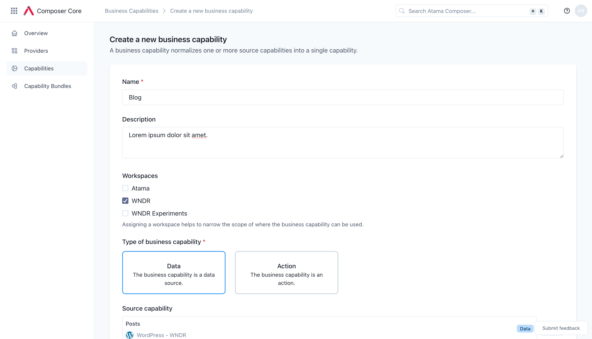
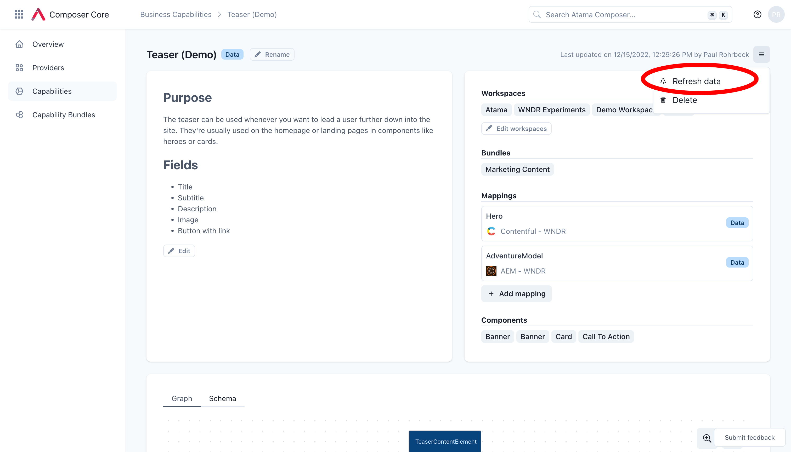

# Business Capability
Atama introduces a layer of abstraction in order to avoid point-to-point integrations and make lifecycle management easier for large systems. One of those abstractions are business capabilities. They serve as a normalized schema for APIs (i.e. source capabilities) provided by 3rd party services (i.e. providers).

You’ll need to have at least one provider and an associated business capability before you can get Atama running end-to-end.

## Types

### Data
Data capabilities are any data that is relatively static and doesn't change from one end user to the next.

Here are some examples:
* single product
* list of blog posts
* hero, teaser

### Action
Action capabilities serve dynamic data or handle user input (POST/PUT requests in the REST world, mutations for GraphQL).

Here are some examples:
* add to cart
* submit form
* show product inventory

## Show Business Capabilities
1. Navigate to [Composer Core > Capabilities](https://composer.atama.app/core/business-capabilities).
2. You can narrow down the list of records by searching and filtering.

## Create Business Capability
1. Navigate to [Composer Core > Capabilities](https://composer.atama.app/core/business-capabilities).
2. Click "+ Create" in the upper right hand corner.
3. Fill out all the required form fields:
    1. "Name" - Used to identify the business capability
    2. "Description" - Optional but recommended to provide more details about what the business capability is all about.
    3. "Workspaces" - Assigning a workspace helps to narrow the scope of where the business capability can be used.
    4. "Type of business capability" - [See above](#types)
    5. "Source capability" - Select the first source capability that this business capability should be mapped to. This will be used as your starting point to define what the business capability is. You can always add additional mappings later ([see below](#add-provider-mapping)) as well as edit the schema of the bisiness capability.
    
4. Click "Create" when you're ready.

Once the business capability is created, here are some next steps that may make sense for you:

* Change the business capability schema ([see below](#edit-schema)) - This is recommended because business capabilities should represent models that make sense for the business and not map 1:1 to source systems.
* [Map the business capability to a component type](../../composer-studio/authoring-guides/component/index.md#example-mapping)
* Add additional providers to the business capability

## Edit Business Capability

### Edit name
To edit the business capability name, click on the "Rename" button right next to the business capability title. Make your changes and click "Confirm".

The change should take effect immediately on this interface but indexed data will need to be re-indexed for the change to take effect.

### Edit description
To edit the business capability description, click on the "Edit" button below the existing description. Make your changes and click "Confirm".

The text field supports markdown formatting for headlines, lists, etc.

### Edit workspaces
To edit the workspaces that a business capability is assigned to, click on the "Edit workspaces" button below the existing list of workspaces. Make your changes and click "Update".

The text field supports markdown formatting for headlines, lists, etc.

### Edit schema

1. Open the business capability that you want to edit.
2. In the bottom half of the screen, select the "Schema" tab.
3. Click on the button "Edit schema" at the bottom of the editor.
4. Make your schema updates.
5. Click "Save" when you're done.

## Add Provider Mapping

1. Open the business capability that you want to add the provider to.
2. Under "Mappings" click on "+ Add mapping"
   
3. From the drawer that appears, select the source capability that you want to add. You can search and filter to narrow down the results. If you're missing a source capability, check the [provider](../../composer-core/providers/README.md) or add a new one.
   
4. This opens up the mapping screen (see instructions below).

## Edit Provider Mapping

1. Open the business capability whose mappings you want to edit.
2. Under "Mappings", click on the mapping you want to change.
3. A new page with a full screen editor should open. There you can use JSONata to map the source system properties to your business capability properties. See our [JSONata reference](../../reference/jsonata-reference.md) for examples.
    1. If it's an action business capability, select "Request" or "Response" from the headline to add the respective mapping.

## Delete Provider Mapping

1. Open the business capability that you want to remove the provider mapping from.
2. Under "Mappings" click on the mapping you wish to delete.
3. Use the menu on the top-right and click on "Delete".

## Refresh Business Capability Data

At the moment we don't have any automatic refresh interval or webhooks set up. That means to get the latest data from your source systems you need to manually refresh the index.

1. Open the business capability that you want to refresh.
2. From the hamburger menu in the top right, click on "Refresh data".
   
3. You should see an alert show up to inform you about the number of records that were indexed.

