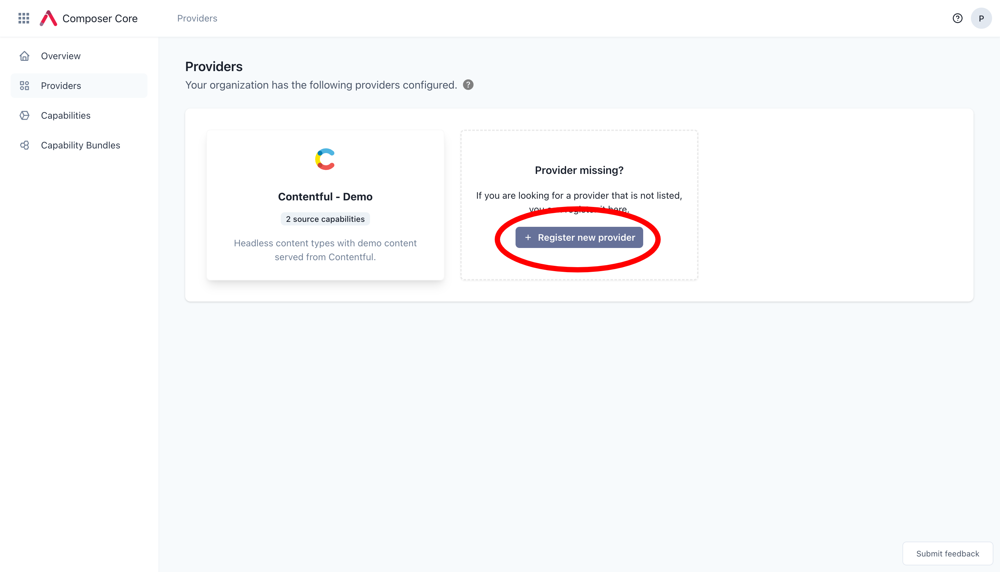
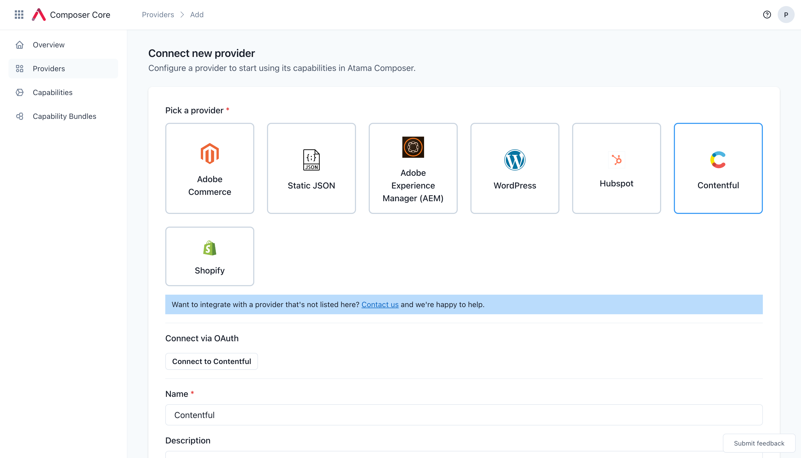

# Providers
Atama providers are lightweight proxies or wrappers around a third party vendor's public APIs, providing a common way for Atama Composer to interact with these systems.

This allows us to decouple Composer implementation details from those of the integrated source systems. For example, the way that you'd fetch a list of blog posts from Wordpress is vastly different from how you might retrieve a product from Adobe Commerce's catalog (REST vs. GraphQL, authentication requirements, etc.). The Providers hide these complexities from the rest of the system and provide an easier method to get content from each system.

You can see documentation for our [existing providers](../../reference/providers/README.md) here.

:::info

We're always looking for new services to integrate with. Please [contact us](https://www.atama.co/contact-us) if you are one of the following:

* a technology vendor that wants to integrate with Atama
* interested in working with Atama but don't see the services you use listed here yet

:::

## Connect to a new provider
1. Navigate to [Composer Core > Providers](https://composer.atama.app/core/providers).
2. Click the "+ Register a new provider" button.
   
3. Select a provider.
   
4. Once you have the provider selected, some extra form fields will appear. Depending on the provider, you may need to go through an OAuth authentication flow or provide us with API credentials.
5. Fill out the rest of the form:
    1. "Name" - You can use the name to differentiate instances of the same type. For example, if you have a *Marketing* and a *Intranet* Contentful space, you can label it accordingly.
    2. "Description" - Optional field for additional meta information.
    3. "Visit URL" - Provide the URL of the service where business users usually log into. This is helpful if users want to see all the source data in its origin outside of Atama.
7. You can confirm that the connection worked by checking that there are source capabilities listed on the provider page.

## Create a new provider
Our provider pattern is extensible so you can easily create your own and connect it to Atama.

:::info

We're working on documentation for this. If you have an urgent need, please [contact us](https://www.atama.co/contact-us).

:::

## How providers work
Here are some technical details about how providers work:

* Providers connect with source systems via their existing APIs. They can use REST, GraphQL, or any other method for accessing data or passing through function calls.
* A provider can provide both `data` and `action` source capabilities (or just one)
* When the provider is first configured (see [how to connect a new provider](#connect-to-a-new-provider)), Atama reaches out to the source system with the information and credentials you entered.
    * As part of this discovery call, we determine the list of source capabilities that the provider supplies.
    * For each source capability, we create a JSON schema representation:
        * Data capabilities only have a single schema
        * Action capabiliities have both a "request" and a "response" schema
* After the initial setup, providers are only called when they're mapped to [business capabilities](../business-capability.md).
    * For data capabilities:
        * Provider data is requested and indexed when a new mapping was added to a business capability.
        * The same happens when mappings are changed or deleted.
        * You can also manually request [re-indexing](../business-capability.md#refresh-business-capability-data) for specific business capabilities.
    * Action capabilities are called directly from your channel experiences (via [components](../../composer-studio/authoring-guides/component/index.md) that map to business capabilities of type action). In this scenario, Atama is just a router to make sure that actions that users take get routed to the proper source system.
