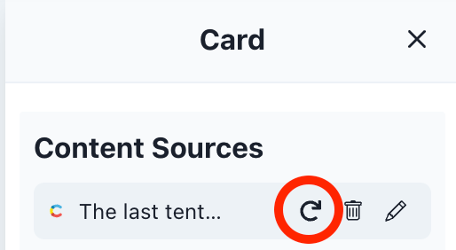

# Experience
An experience is an interaction between your organization and a user (customer, partner or employee). It can target one or more channels.

## Show Experiences
To see all experiences in the current workspace, navigate to the "Experiences" page. You can narrow down the table of records by searching, filtering, or sorting the table.

## Create Experience

1. Click the "+ Create" button either from the "Home" screen or on the "Experiences" page.
2. Enter a "Name". The name is only used within Atama and not exposed to the public. You can always change it later.
3. Select a channel.
4. Select a blueprint.

## Edit Experience
### Overview
On the overview you can see a list of the experience’s channels and add/remove channels as needed. You can also delete the experience and change its name.

### Channel Properties
As the name implies, channel Properties are properties that are specific to a particular channel. For example, a website channel would commonly have SEO properties like title and description, as well as a "Slug" that’s used in the URL of the page.

#### Edit Properties
To edit the properties, simply update the values in the form fields and click "Apply" when you’re done.

#### Slug
The "Slug" is a special field used for publishing the experience to a website channel. There are some recommended rules to create a proper slug:

* Starts with a slash /
* Replace spaces with hyphens -, don’t use any other special characters
* Use slashes to represent the hierarchy of your site, for example /resources/case-studies/abc
* Should be lowercase

### Add Component
Components are added via the "Placements" panel on the left of the experience editor.

1. Choose a Placement area that you want to add the component to.
2. You can add components to the end or in-between other already existing components. Hover between the existing components to see the "+ Add Component" prompt.
3. Open the "Select Component" dropdown.
4. If you know the Component’s name, you can search for it in the input. Otherwise, select it from the list.
5. The component should now be added to the preview site and you can move on to the "Edit Component" step below.

:::info

If you're expecting a component to be available and it's not, check the [blueprint](../blueprint/index.md) configuration.

:::

### Edit Component
To edit a component you can click on it from the "Placements" panel on the left or you can click on the pencil icon that appears when you hover over the component within the preview.

#### Selecting a content source
The content source defines what content is loaded into the component. Instead of writing content directly in Atama, it’s brought in from external systems via [providers](../../../composer-core/providers/README.md).

1. Click on "+ Add Content Source".
2. This opens up a separate overlay that helps you find the right piece of content.
    1. To narrow down the results, you can
        1. Search for keywords
        2. Filter by Business Capability
        3. Filter By Provider
    2. The tab "Previously Used Content Sources" lists content that’s already in use in your current Experience.
    3. The tab "All Content Sources" shows all other sources.
3. Once you’ve found the content entry you want to add, click "+ Add".
4. This closes the overlay and updates the preview with the selected data.
5. If you’re happy with your selection, click "Apply" at the bottom of the panel.

:::info

If the content you're looking for does not exist, you can refresh Atama's index by clicking on the "Refresh indexed data" link at the top right.

:::

#### Refreshing a content source
If there are changes to a content source that's already in use, follow these steps to refresh the content in Atama:

1. Open up the [Edit Component](#edit-Component) panel.
2. Hover over the content source.
3. Click the refresh icon.
4. It may take a few seconds for the content in the panel and preview to be updated.

#### Links
If your components allow links to other experiences within Atama, you should see a pencil button next to the field under "Content Properties".

1. Click on the pencil icon next to "Select experience".
2. This opens up a modal window where you can search for the experience you want to link to.
3. Click on the "+ Select" to confirm your choice.
4. Make sure to click "Apply" at the bottom of the panel to save your updates.

:::info

You can only link to published experiences.

:::

#### Visual Properties
Your components may have some built-in flexibility when it comes to the way they’re presented to the user. Common examples include background, font colors, and image & text alignment.

1. Make a selection from the property dropdown.
2. Click "Apply" at the bottom of the panel to save your updates.

### Move Component

1. To move or re-order a component, hover over it in the "Placements" panel.
2. On the right side, you should see a dotted icon appear. Click and drag it to the desired position.

:::info

You can’t move components to other Placements at this time.

:::

### Remove Component
1. To remove a component, hover over the component in the preview area.
2. You should see a trash icon appear in the upper right hand corner of the rendered component.
3. Click the trash icon to proceed.
4. If you’re certain you want to remove the component, confirm your decision by clicking "Delete".

## Delete Experience
1. Navigate to the experience overview screen by clicking on the name of the experience in the experience list. If you already have an experience open, you can get there by clicking the info button in the top left.
2. Click the "Delete" button below the experience name.
3. If you're certain, confirm your action by clicking "Yes, Delete". Note that this button is only active if the experience can be deleted. If any of the experience's channels have already been published, you'll need to unpublish them first. This avoids orphaned content that only exists in the published environment.

## Publish Experience
Once you’re ready for your experience to be published, follow these steps to make it live:

1. Click on "Publish" in the upper right hand corner of the experience editor screen.
2. In the dropdown that opens up, click on "Publish" under the "Publish" headline.
3. This will open up a modal window where you can again confirm that you’re ready. If there are missing properties on the experience or one of its components it will also let you know and prevent you from moving forward.
4. Click "Yes, Publish".
5. You can then navigate to the same "Publish" menu as before and click on "View Published" to see your experience in action.

## Unpublish Experience
If you want to unpublish an experience that's currently live, follow these steps:

1. Click on "Publish" in the upper right hand corner of the experience editor screen.
2. In the dropdown that opens up, click on "Unpublish" under the "Unpublish" headline.
3. This will open up a modal window asking for confirmation.
4. Click "Yes, Unpublish" if you're certain you want to proceed.

Please note that currently we do not check whether the experience has any links pointed to it.

## Version History
Every time an experience is published, a new version is created.

Here's how you can see the timeline of previous versions:

1. Open up the experience editor
2. Open the "Publish" menu in the upper right hand corner
3. Click on "Version History" at the bottom
