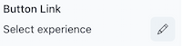
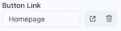

# Component

A component is a block within an [experience](../experience/index.md) for a specific channel (web, email, etc.). The component type defines what data the code is expecting and how business capabilities map to it.

## Show Component Types

1. Navigate to the "organization" view.
2. Select "Component Types" from the main navigation. You can narrow down the results by filtering by a specific channel.

## Create Component Type

1. Navigate to the "organization" view.
2. Select "Component Types" from the main navigation.
3. Click "Create".
4. Fill out the form:
    1. "Name" – Name that will be shown to the marketing users when composing experiences.
    2. "Type" – Name of the React/Vue/etc. component in your codebase.
    3. "Channels" – The component will only be available in blueprints that match the selected channels.
    4. "Content Property Configuration" – JSON Schema for the component’s content properties.
    5. "Visual Property Configuration" – JSON Schema for the component’s visual properties.
5. Click "Create".
6. Once the component type has been created, you need to map one or more [business capabilities](../business-capability.md) to it via [JSONata](https://docs.jsonata.org) queries (see example below).

### Content properties

Here are some tips for working with the JSON schema for components:

* The `examples` are optional but recommended. They are used as placeholders when no content source has been selected yet. That means, when the component is first added to the page, the user can already see what it will look like.
* The array of `required` properties is used by the component to validate user input. If a content source has been selected and it doesn't have all the required properties, the user won't be able to save the changes.
* Each property has a `title` field that is used as the user-friendly name that's shown in the editor.

#### Example

```json
{
  "$schema": "http://json-schema.org/draft-07/schema",
  "$id": "#/componentType/contentProperties/CtaBanner",
  "type": "object",
  "examples": [
    {
      "title": "Lorem ipsum dolor sit amet",
      "subtitle": "Lorem ipsum dolor sit amet, consectetur adipiscing elit",
      "eyebrow": "Dit amet",
      "primaryCtaLabel": "Lorem ipsum"
    }
  ],
  "required": [
    "title",
    "primaryCtaLabel"
  ],
  "properties": {
    "title": {
      "$id": "#/properties/title",
      "type": "string",
      "title": "Title"
    },
    "subtitle": {
      "$id": "#/properties/subtitle",
      "type": "string",
      "title": "Subtitle"
    },
    "eyebrow": {
      "$id": "#/properties/eyebrow",
      "type": "string",
      "title": "Eyebrow"
    },
    "primaryCtaLabel": {
      "$id": "#/properties/primaryCtaLabel",
      "type": "string",
      "title": "Primary CTA Label"
    },
    "primaryCtaLink": {
      "type": "string",
      "title": "Primary CTA Link",
      "format": "atamaLink"
    }
  },
  "additionalProperties": true
}
```

Note the special type `atamaLink` for linking to other Channel Experiences within Atama.

### Visual properties

#### Example

```json
{
  "$schema": "http://json-schema.org/draft-07/schema",
  "$id": "#/componentType/visualProperties/CtaBanner",
  "type": "object",
  "required": [],
  "properties": {
    "background": {
      "$id": "#/properties/background",
      "type": "string",
      "title": "Background",
      "default": "",
      "enum": [
        "",
        "gray",
        "light-image",
        "dark-image"
      ]
    },
    "primaryCtaColor": {
      "$id": "#/properties/primaryCtaColor",
      "type": "string",
      "title": "CTA Color",
      "default": "blue",
      "enum": [
        "blue",
        "purple"
      ]
    }
  },
  "additionalProperties": true
}
```

### Example mapping

The following JSONata maps a business capability to a component type with a slightly different schema:

```json
{
  "title": name,
  "subtitle": secondaryName,
  "eyebrow": eyebrow,
  "primaryCtaLabel": ctaLabel
}
```

Please refer to our [JSONata reference doc](../../composer-core/jsonata-reference.md) for examples of advanced mapping use cases.

## Edit Component Type

1. Navigate to the "organization" view.
2. Select "Component Types" from the main navigation.
3. Click on the name of the component type that you want to edit.


## Special field types

### Links

If you would like marketers to be able to link to other experiences within Atama, you can mark a property as an `atamaLink`.

```
    "primaryCtaLink": {
      "type": "string",
      "title": "Button Link",
      "format": "atamaLink"
    }
```

Here's how this will render for the marketer:



