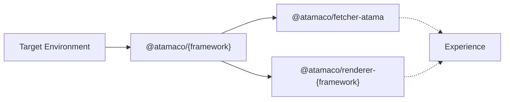
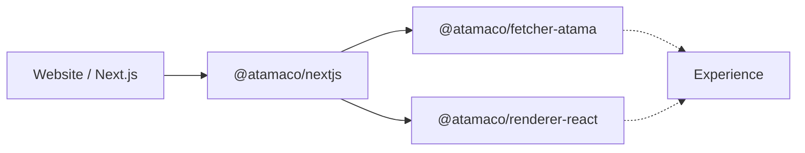

# CX Framework

The CX Framework (Customer Experience Framework) is responsible for rendering your composed experiences in your target environment. A target environment can be any user-facing channel or touchpoint like a website, email, or digital signage. Check out our Guides section for examples or take a look at the high-level overview below.

## Overview

Connecting Composer Core to your environment usually involves the following 3 parts:

1. [Integration](./integration/README.md) — For each target environment we provide an integration that accepts a fetcher.
2. [Fetcher](./fetcher/README.md) — The Fetcher is responsible for fetching the information about the composed experience from a source (e.g. our [Delivery API](./delivery-api.md)).
3. [Renderer](./renderer/README.md) — The integration then hands off the returned data to the Renderer that - based on the provided layouts and components - renders the actual experience.

## Example

This is what the above graph would look like when your website uses [Next.js](https://nextjs.org/):

