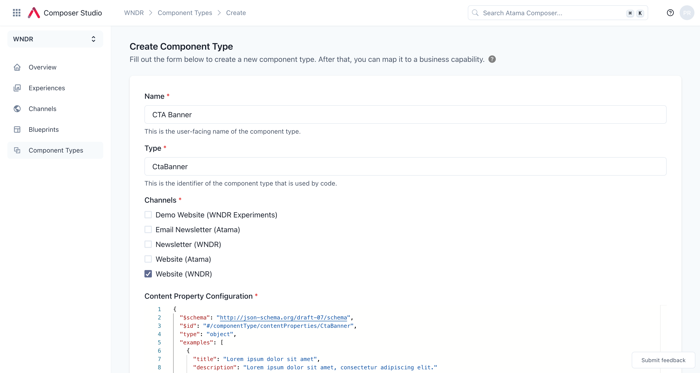
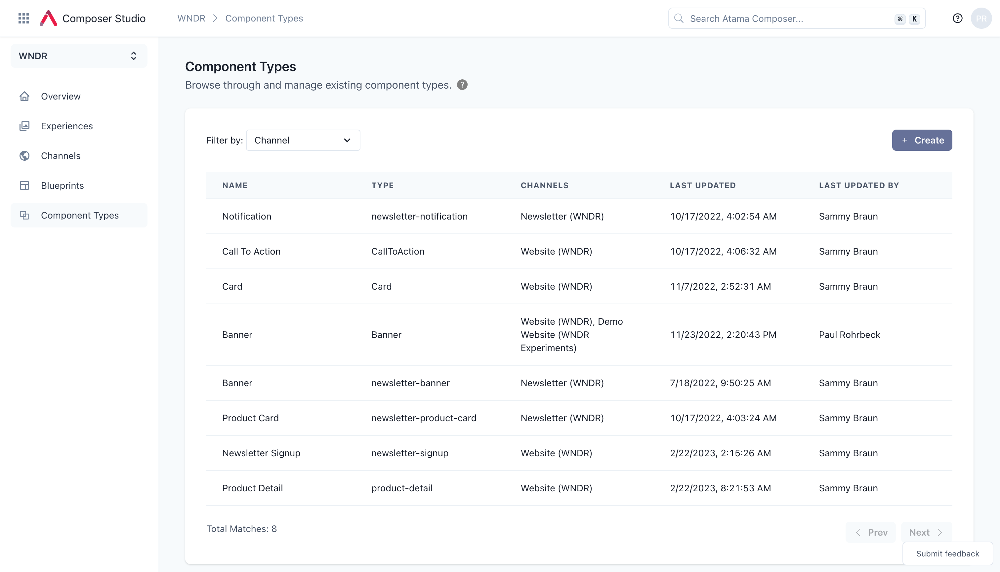
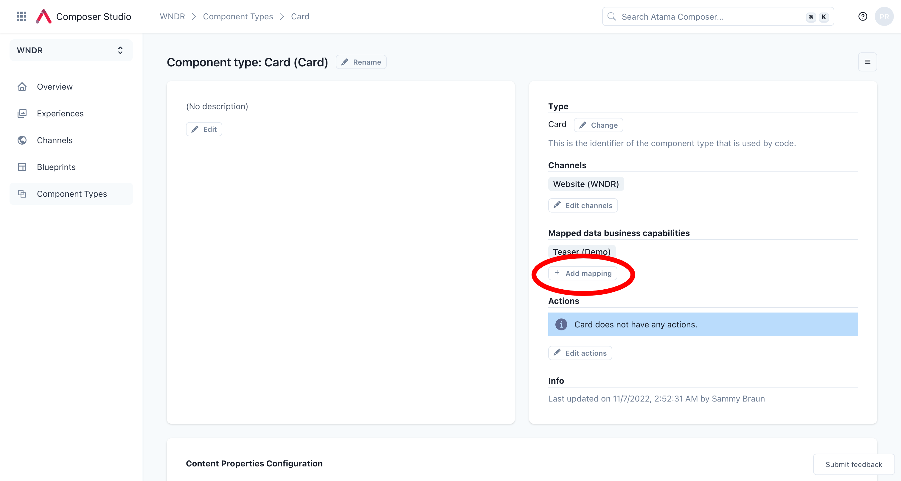
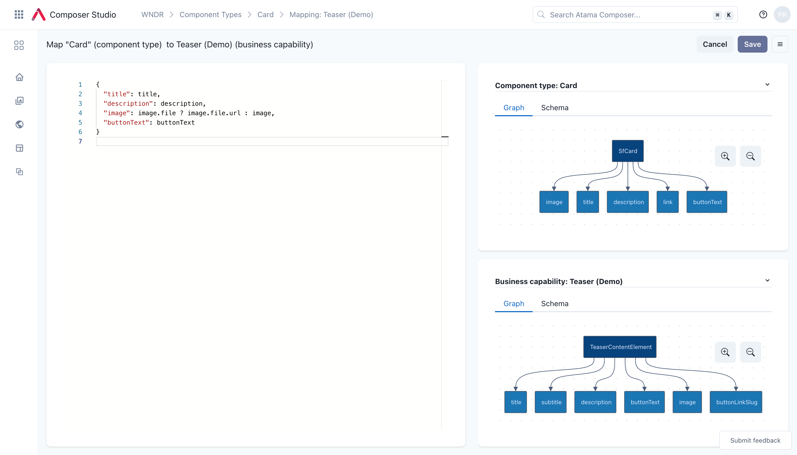
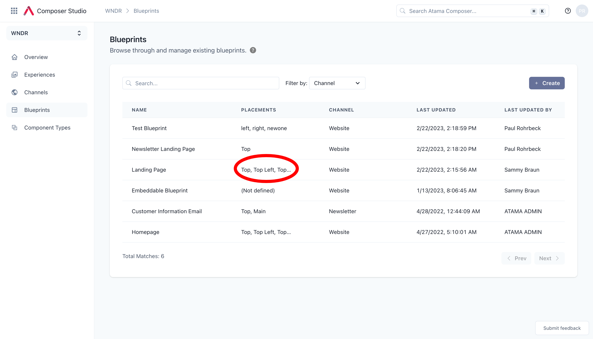
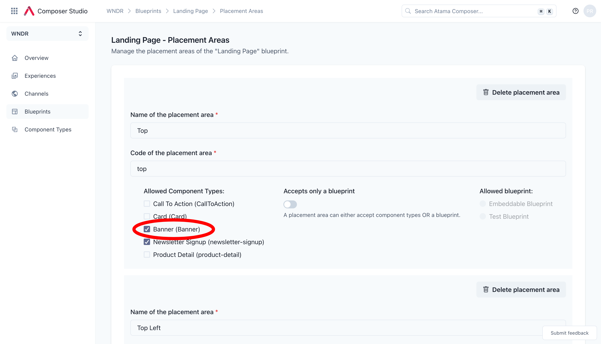

# Adding a new component type

In this guide, you'll learn how your component code connects with Atama and how the component type maps to one or more business capabilities.


:::info

This guide assumes you've gone through our [quickstart](../quickstart/index.md) and have a codebase already connected to Atama.

:::

## Process

Here are the typical steps for creating a new component:
1. Identify a business need that can't be fulfilled with existing components.
2. Check if there's already a [business capability](../../composer-core/business-capability/README.md) for the desired functionality.
    1. If not, the business capability should be created first. It's a best practice that development is driven by a business need.
    2. For the purposes of this guide, we'll assume we can re-use an existing business capability.
3. Develop the component code based on the provided business specifications. This steps happens outside of Atama in whatever codebase or framework that your channel uses.
4. Once you have the component code, you can register the component in Atama.
5. Then, you map the component to the business capability you identified or created above.
6. Last but not least, you update your blueprint(s) so that your new component is available to use.

## Write your component code

For the purpose of this guide, let's assume you've gone through our [quickstart](../quickstart/index.md) and have a Hydrogen codebase. Let's take the existing `CallToAction` [component](https://github.com/AtamaCo/template-hydrogen/blob/main/src/components/atama/call-to-action.tsx) as our base.

### Example code

Let's keep it simple and just rename the component to `CtaBanner` but keep everything else the same.

```tsx
import clsx from 'clsx';
import {Button} from './foundation/button';

export function CtaBanner({
  title,
  description,
  buttonText,
  background,
  atama,
}: {
  title: string;
  description: string;
  buttonText: string;
  background: 'gray';
  atama: object;
}) {
  const backgroundColors = {
    gray: 'bg-neutral-300 dark:bg-zinc-900 dark:border-2 dark:border-zinc-800 rounded',
  };

  return (
    <div
      className={clsx(
        backgroundColors[background],
        'flex flex-col md:flex-row gap-16 px-8 py-10',
      )}
      {...atama}
    >
      <div className="grid gap-4">
        <p className="font-bold text-4xl">{title}</p>
        <p>{description}</p>
      </div>
      <div className="flex items-center">
        <Button href="#">{buttonText}</Button>
      </div>
    </div>
  );
}
```

Note the `atama` property that is spread on the outer most div: `{...atama}`. This enables editing and live preview in Composer Studio.

### Register the component with the AtamaRenderer

In order for the `AtamaRenderer` to know about the new component, we need to add it to the list of components. Search for `AtamaRenderer` in your codebase and add your new component to the list.

For the Hydrogen codebase, this happens in two places: `src/lib/atama.client.tsx` and `src/lib/atama.server.tsx`. Let's add our new `CtaBanner` to the list as in this example:

```
export const components = {
  Banner,
  Card,
  CallToAction,
  CtaBanner
};
```

## Add component in Studio

Next, you need to let Composer Studio know about your new component.

1. Navigate to [Composer Studio](https://composer.atama.app/studio) and select a workspace.
2. Select "Component Types" from the main navigation.
3. Click "Create".
4. Fill out the form:
    1. "Name" – Name that will be shown to the marketing users when composing experiences. **For our example, you can make this "CTA Banner".**
    2. "Type" – Name of the React/Vue/etc. component in your codebase. **Use "CtaBanner" for our example.**
    3. "Channels" – The component will only be available in blueprints that match the selected channels. **Select at least one channel.**
    4. "Content Property Configuration" – JSON Schema for the component’s content properties. **See example schema below.**
    5. "Visual Property Configuration" – JSON Schema for the component’s visual properties. **See example schema below.**
    
5. Click "Create".

### Content Property Configuration - Example

Here's an example schema that matches the properties of the `CtaBanner` component above.

```json
{
  "$schema": "http://json-schema.org/draft-07/schema",
  "$id": "#/componentType/contentProperties/CtaBanner",
  "type": "object",
  "examples": [
    {
      "title": "Lorem ipsum dolor sit amet",
      "description": "Lorem ipsum dolor sit amet, consectetur adipiscing elit."
      "buttonText": "Lorem ipsum"
    }
  ],
  "required": [
    "title",
    "description"
  ],
  "properties": {
    "title": {
      "$id": "#/properties/title",
      "type": "string",
      "title": "Title"
    },
    "description": {
      "$id": "#/properties/description",
      "type": "string",
      "title": "Description"
    },
    "buttonText": {
      "$id": "#/properties/buttonText",
      "type": "string",
      "title": "Button Text"
    },
  },
  "additionalProperties": true
}
```

### Visual Property Configuration - Example

Here's an example schema for the visual properties of the `CtaBanner` component above. There's only one property `background` with only one option `gray`. See the `backgroundColors` in the code above for what `gray` refers to.

```json
{
  "$schema": "http://json-schema.org/draft-07/schema",
  "$id": "#/componentType/visualProperties/CtaBanner",
  "type": "object",
  "required": [
    "background"
  ],
  "properties": {
    "background": {
      "$id": "#/properties/background",
      "type": "string",
      "title": "Background",
      "description": "Defines the background color of the banner.",
      "default": "gray",
      "enum": [
        "gray"
      ]
    }
  },
  "additionalProperties": true
}
```

## Map component to business capabilities

In order for the new component to be usable, it needs to be associated with one or more business capabilities. This essentially defines the data that will power the component.

1. If you're not already on the detail page for the component type, open that up now. You can get there from the "Component Types" link in the main navigation and then clicking on the name of the component in the table.
  
2. Click on "+ Add mapping" under the "Mapped data business capabilities" headline.
  
2. Add the mapping instructions using JSONata notation. For our example, pick the `Content Element` business capability and then map it like this:

```json
{
  "title": title,
  "description": body,
  "buttonText": buttonText
}
```
  

3. Repeat steps 1-2 if you want to map additional business capabilities.

Please refer to our [JSONata reference doc](../../reference/jsonata-reference.md) for examples of advanced mapping use cases.

## Add component to blueprint

Last but not least, you need to update your blueprint(s) so that your new component is available for marketers to use.

1. Navigate to the workspace that this component is for.
2. Click "Blueprints" from the main menu on the left.
3. Locate the blueprint that you would like to add the component to.
4. Click on the linked list of "Placements"
   
5. This takes you to a configuration page where you can define what placement area allows what components. To add your component, simply check the box and then hit "Save changes" at the bottom of the page.
  

And that's it. Now you should be able to see the component available in the experience editor.
