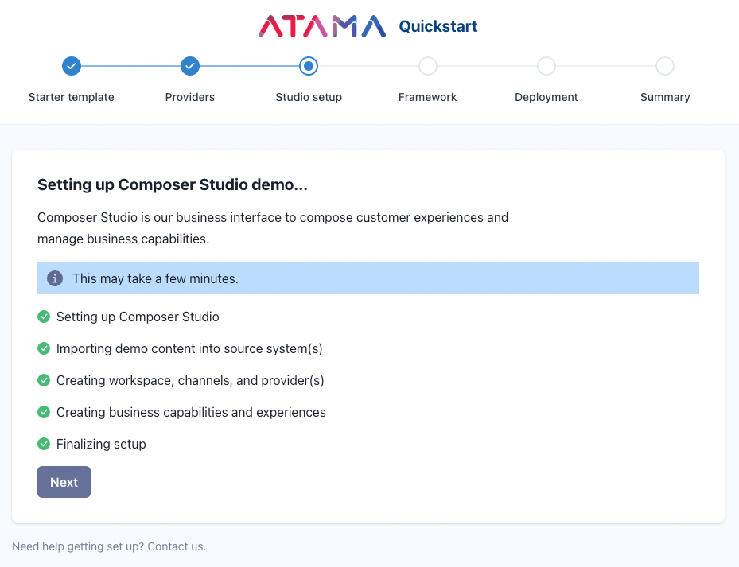

# Quickstart

A composable orchestration platform like Atama Composer has a lot of moving pieces. If you're new to Atama, we recommend you start with this [introduction](../../getting-started/README.md#overview).

It may seem overwhelming to get started but don't worry, we've got you covered. If you need help at any point during the process, don't hesitate to [contact us](https://www.atama.co/contact-us).

Our quickstart offers a streamlined way to set up a demo with Atama Composer. Following the steps below, you should be up and running in less than 10 minutes.

1. Register for Atama
2. Navigate to [composer.atama.app/quickstart](https://composer.atama.app/quickstart)
3. Follow the steps of the quickstart guide (see details below)

---

## Guide
The quickstart guide lets you make a series of selections to put together your composable stack. For each choice, click the respective card or "Select" button to move to the next step.

1. Starter template
2. Providers
3. Studio setup
4. Deployment

## Starter template
The starter template defines what front-end and source system your website starts with. We may also import some demo content into your source system. You can change all this later.

If you are not interested in importing demo data into Atama and your source system, you may skip the quickstart altogether. Simply click the "Skip" button in the upper right hand corner.

### Available starter templates

#### Commerce Landing Page Demo
This template ships with a commerce frontend (Hydrogen) that lets marketers create landing pages with content being provided by Contentful. The commerce functionality (product listing + detail pages, cart, checkout, etc.) is provided by the respective commerce engine (Shopify) that the front end integrates with outside of Atama.

To go through the quickstart, you'll need the following accounts which should be available for free:
* [Contentful](https://www.contentful.com/) account
* [Vercel](https://vercel.com/) account
* A GitHub, GitLab, or Bitbucket account

:::info

More templates coming soon. If you're looking for something in particular, please [contact us](https://www.atama.co/contact-us).

:::

## Providers
Atama Composer connects to source systems via their API. We have a pattern called [providers](../../composer-core/providers/README.md) to do this.

Based on the starter template you selected, you'll see one or more providers listed on this step. Some providers allow OAuth authentication and for others you'll need to provide a username/password or API key directly. We store API keys securely and never share them with anyone.

During the OAuth flow, make sure you grant Atama the requested permissions. Otherwise, we won't be able to properly import demo content or read data.

## Studio setup

The data import step sets up Composer Studio so it's ready to use. The details of what it does depend on the template you selected. For most templates, it will import some demo content into your source system. Based on that, we can then create demo business capabilities and experiences.

1. Setting up Composer Studio
2. Importing demo content into source system(s)
3. Creating workspace, channels, and provider(s)
4. Creating business capabilities and experiences

## Deployment
In this step you have to pick a hosting service to deploy your project to.

Once you click 'Select' on a hosting vendor, a new window will open. This will guide you through the hosting setup on their end and may include cloning a git repository.

Please leave the quickstart window open so you can copy/paste the API information from the bottom of the page.

## Summary
And that's it. Once you've completed the deployment step, you should have a full end-to-end demo project running with Atama.

From here, you can either explore Studion on your own, or follow on of our other step-by-step guides.

