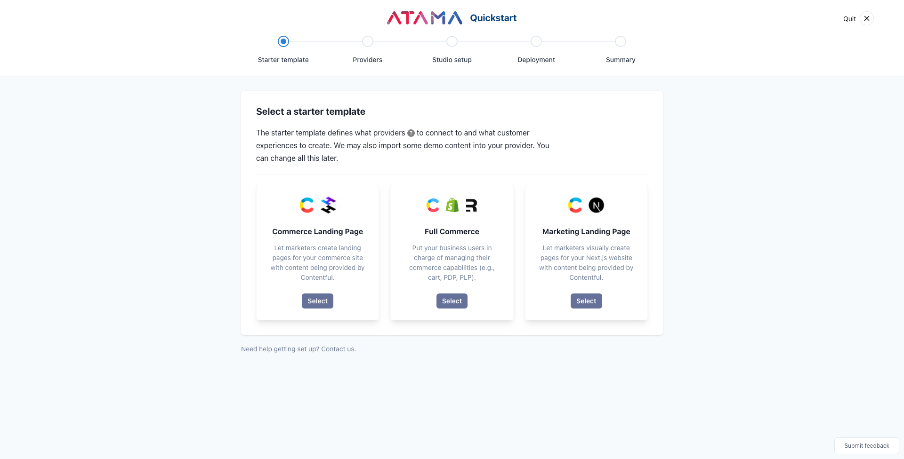
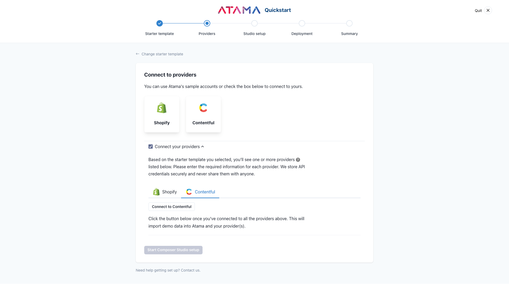
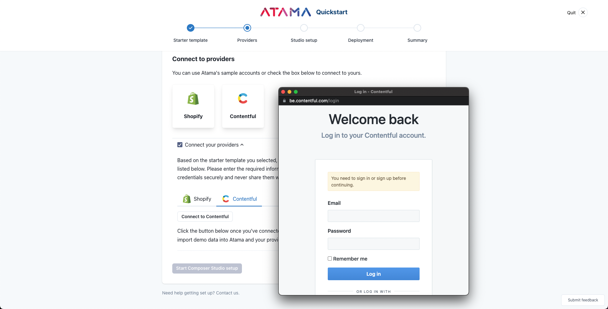
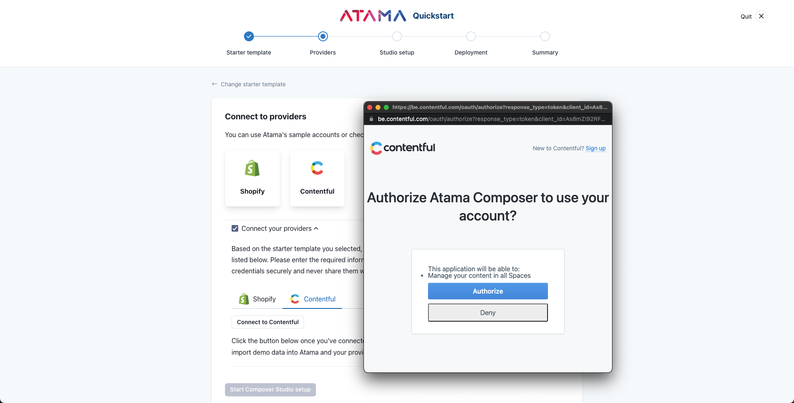
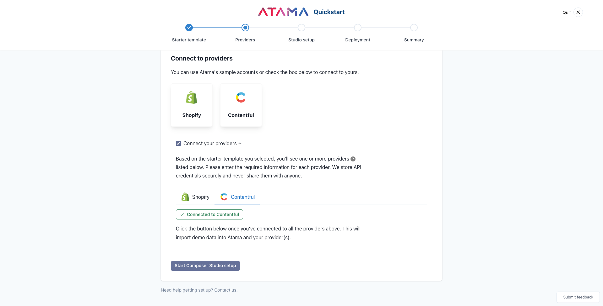
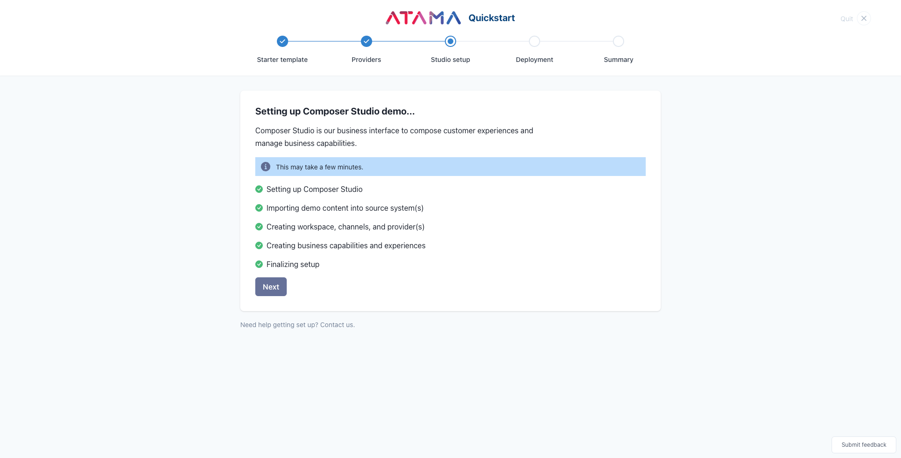
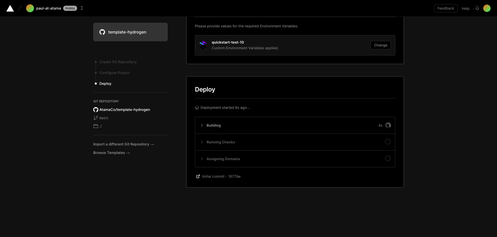
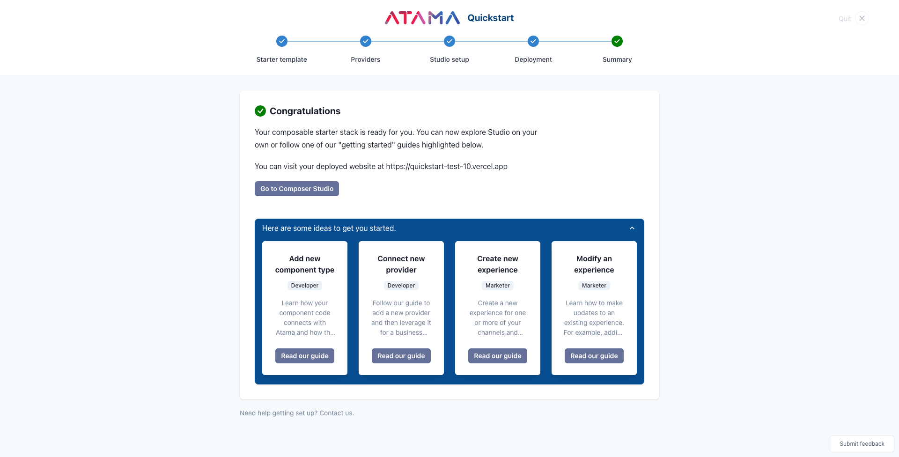

# Quickstart
A composable orchestration platform like Atama Composer has a lot of moving pieces. If you're new to Atama, we recommend you start with this [introduction](../../getting-started/README.md#overview).

It may seem overwhelming to get started but don't worry, we've got you covered. If you need help at any point during the process, don't hesitate to [contact us](https://www.atama.co/contact-us).

Our quickstart offers a streamlined way to set up a demo with Atama Composer. Following the steps below, you should be up and running in less than 10 minutes.

1. Register for Atama
2. Navigate to [composer.atama.app/quickstart](https://composer.atama.app/quickstart)
3. Follow the steps of the quickstart guide (see details below)

---

## Guide
The quickstart guide lets you make a series of selections to put together your composable stack. For each choice, click the respective card or "Select" button to move to the next step.

1. Starter template
2. Providers
3. Studio setup
4. Deployment

## Starter template
The starter template defines what front-end and source system your website starts with. If you choose to connect with your own account vs. our sample ones, we may also import some demo content into your source system. This ensures that we can create a nice end-to-end demo experience. You can easily change everything that's created later.

If you prefer to explore and setup Composer by yourself, you may skip the quickstart altogether. Simply click the "Quit" button in the upper right hand corner.

### Available starter templates

#### Commerce Landing Page
This template ships with a commerce frontend (Hydrogen) that lets marketers create landing pages with content being provided by Contentful. The commerce functionality (product listing + detail pages, cart, checkout, etc.) is provided by Shopify and the front end integrates with it outside of Atama.
* Providers: Contentful
* Frontend: Hydrogen

#### Full Commerce Page
The difference for this template compared to the "Commerce Landing Page" template is that the commerce functionality (product listing + detail pages, cart, etc.) is using business capabilities managed in Atama. That level of abstraction can come in handy later when you want to test and migrate to use a different commerce provider.
* Providers: Contentful, Shopify
* Frontend: Remix

This template shows the value of Atama Composer the best.

#### Marketing Landing Page
As the name implies, marketers can create landing pages with content being provided by Contentful.
* Providers: Contentful
* Frontend: Next.js

These are just starting points so you can get a better feel for Atama Composer. All templates come with a handful of basic React components. You can easily add additional components, services, and front ends (channels) later.

:::info

We're always looking to add more useful templates. If you're looking for something in particular, please [contact us](https://www.atama.co/contact-us).

:::

## Providers
Atama Composer connects to source systems via their API. We have a pattern called [providers](../../composer-core/providers/README.md) to do this.

Based on the starter template you selected, you'll see one or more providers listed on this step.

Some providers allow OAuth authentication and for others you'll need to provide a username/password or API key directly. We store API keys securely and never share them with anyone.

### Using Atama's demo accounts

If you don't want to sign up for your own demo accounts, you can use Atama's. You won't be able to edit any content but it's a quick way to get familiar with Atama Composer.

By default, we'll use Atama's demo accounts as shown here.

### Using your own accounts
If you would rather connect to your own accounts, click the "Connect your providers" checkbox.

Contentful is an example of a provider that uses OAuth to authenticate. Click the "Connect to Contentful" button to go through the authentication flow.

The Shopify provider requires you to enter API information manually.

To start the OAuth flow, log into the service with your account.

During the OAuth flow, make sure you grant Atama the requested permissions. Otherwise, we won't be able to properly import demo content or read data.

If you have multiple Contentful workspaces, make sure to select the one you want to use for Atama. If there's no workspace yet, we'll create one for you called "Atama Composer".

This is what a successful OAuth connection looks like.

## Studio setup
The data import step sets up Composer Studio so it's ready to use. The details of what it does depend on the template you selected. For most templates, it will import some demo content into your source system. Based on that, we can then create demo business capabilities and experiences.

1. Setting up Composer Studio
2. Importing demo content into source system(s)
3. Creating workspace, channels, and provider(s)
4. Creating business capabilities and experiences

## Deployment
In this step you have to pick where you want to deploy your website to.

By default, we'll use our git repository and hosting provider.

### Using Atama's hosting

### Using your own hosting

Once you click 'Select' on a hosting vendor, a new window will open. This will guide you through the hosting setup on their end and may include cloning a git repository.

Please leave the quickstart window open so you can copy/paste the API information from the bottom of the page.

Pick one of the git providers. We're using GitHub in this example.

Enter the name for what the git repository should be called.

Copy in the required environment variables from the Atama Quickstart screen.

The deployment may take a couple of minutes.

Once everything has been successfully deployed, you'll be redirected back to the Atama Quickstart screen.

## Summary
And that's it. Once you've completed the deployment step, you should have a full end-to-end demo project running with Atama.

From here, you can either explore Studio on your own, or follow on of our other step-by-step guides.

